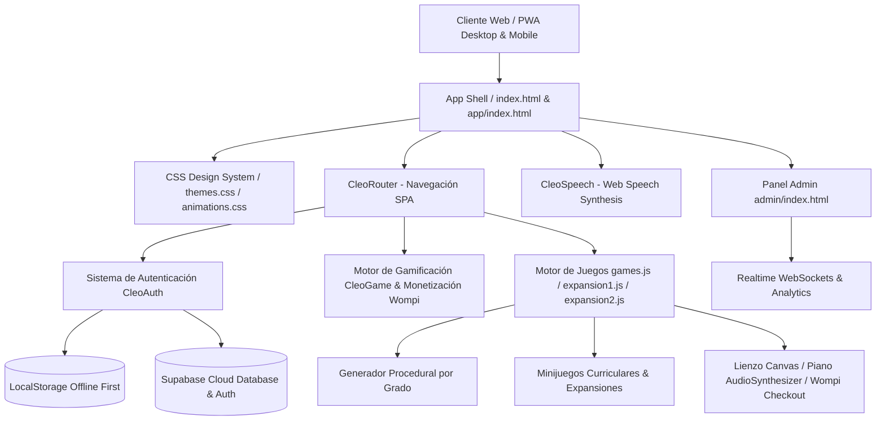

# CLEDUCA — Documentación Completa del Sistema y Aplicación Educativa Gamificada

> **Plataforma Interactiva de Aprendizaje Inclusivo y Gamificado para Niños de Primaria (1° a 5° Grado)**  
> *Alineado con el Currículo Oficial del Ministerio de Educación Nacional (MEN) de Colombia 🇨🇴*

---

## 📖 1. Visión y Propósito General

**CLEDUCA** es un ecosistema educativo digital diseñado para transformar el aprendizaje en la educación primaria en una experiencia inmersiva, accesible, divertida y emocionalmente significativa. 

A través de la integración de minijuegos pedagógicos, narrativas interactivas, síntesis de voz en tiempo real, generador procedural de ejercicios y una economía de juego equilibrada (XP, niveles, rachas, vidas y personalización), CLEDUCA ayuda a niños entre 6 y 11 años a fortalecer sus competencias fundamentales en:

- **Matemáticas** (Cálculo, pensamiento espacial, numérico y resolución de problemas).
- **Lenguaje y Literatura** (Lectura crítica, ortografía, gramática, vocabulario y expresión escrita).
- **Ciencias Naturales** (Biología, cuerpo humano, botánica, física, ecosistemas y cuidado ambiental).
- **Ciencias Sociales y Ciudadanía** (Historia de Colombia, geografía, cultura y derechos).
- **Pensamiento Lógico y Computacional** (Algoritmos, secuencias, patrones, encriptación y deducción).
- **Arte y Creatividad** (Expresión plástica, teoría del color, píxel art y piano musical).
- **Idiomas del Mundo** (Inglés, Portugués, Francés y Alemán en rutas gamificadas tipo Duolingo).

### 🐶 Cleo: La Mascota Husky y Acompañante de Aprendizaje
El centro emocional de la plataforma es **Cleo**, una tierna perrita Siberian Husky que interactúa mediante expresiones faciales dinámicas, cambios de vestuario (incluyendo su Capa SVG de superhéroe) y síntesis de voz (*Web Speech API*). Cleo motiva al estudiante, felicita sus aciertos, ofrece pistas en momentos de dificultad y acompaña cada etapa del desarrollo académico.

---

## 🎨 2. Landing Page y Experiencia de Entrada (App Shell & Routing)

La plataforma cuenta con una arquitectura de entrada dividida para optimizar la captación de usuarios y la experiencia de juego:

```
┌─────────────────────────────────────────────────────────────┐
│                      ☁️   ☁️    ☁️                           │
│                         [ CLEO ] 🐶                         │
│                         (Animación)                         │
│                                                             │
│                          CLEDUCA                            │
│              ¡Aprende jugando con Cleo! 🌟                   │
│                                                             │
│         [ ¡EMPEZAR A JUGAR! 🚀 ]    [ 🔑 ACCESO ADMIN ]     │
│                                                             │
│               Educación interactiva para Colombia 🇨🇴         │
└─────────────────────────────────────────────────────────────┘
```

- **Landing Page (`/` o `index.html`)**: Presentación comercial, características pedagógicas, testimonios, planes de suscripción y llamado a la acción.
- **PWA Web App (`/app/` o `app/index.html`)**: Interfaz optimizada para pantalla completa, modo aplicación instalable y ejecución de minijuegos sin distracciones.
- **Panel de Administración (`/admin/` o `admin/index.html`)**: Dashboard directivo para monitoreo en vivo de usuarios, métricas de retención, pagos Wompi, telemetría y leads de colegios.
- **Fondo con Gradiente Vivo y Micro-animaciones**: Nubes flotantes en bucle (`float`), efectos de rebote (`bounceIn`) y sombras suaves.
- **Interacción de Voz Inmediata**: Al tocar la mascota Cleo en la pantalla de bienvenida, la app pronuncia un mensaje de saludo personalizado utilizando la voz sintetizada en español latinoamericano.

---

## 🏗️ 3. Arquitectura Técnica y Stack Tecnológico

CLEDUCA está construida bajo una filosofía de alto rendimiento, cero dependencias pesadas y máxima compatibilidad multiplataforma.



### Tecnologías Clave:
- **Frontend Core**: HTML5 Semántico, JavaScript Modular (ES6+ Vanilla), CSS3 Moderno (Variables CSS, Flexbox, CSS Grid, Animaciones Keyframes).
- **Single Page Application (SPA)**: Sistema de ruteo dinámico interno (`CleoRouter`) que permite transiciones instantáneas entre vistas sin recarga del navegador, compatible con la navegación nativa de dispositivos móviles (`popstate`).
- **Arquitectura de Almacenamiento Dual**:
  - **Offline First**: Estado de progreso, inventario, niveles y configuraciones guardados en `localStorage`.
  - **Cloud Sync (Supabase v2)**: Registro e inicio de sesión con email/password y Google OAuth 2.0, sincronizando automáticamente los perfiles familiares en la nube.
- **PWA (Progressive Web App)**:
  - **Service Worker (`sw.js`)**: Cacheo completo de recursos estáticos para funcionamiento 100% offline.
  - **Manifest (`manifest.json`)**: Instalable en dispositivos Android, iOS, Windows y macOS como app nativa.
  - **Notificaciones Web**: Alertas locales para recordar mantener la racha de estudio diaria.
- **Motor de Audio y Voz (`CleoSpeech`)**:
  - Web Speech API nativa con filtro automático de voces femeninas en español latinoamericano (`es-CO`/`es-MX`).
  - Ajuste fino de *pitch* (1.35) y *rate* (0.92) para lograr una voz infantil, cálida y amigable.

---

## 👥 4. Sistema de Cuentas, Perfiles y Control Parental (`js/auth.js`)

CLEDUCA permite que múltiples niños compartan el mismo dispositivo manteniendo sus progresos independientes.

### Funcionalidades de Autenticación y Cuentas:
1. **Modalidad Invitado (Sin Cuenta)**: Permite iniciar de inmediato sin registro previo.
2. **Cuentas en la Nube (Supabase)**:
   - Registro e inicio de sesión con correo electrónico y contraseña.
   - Autenticación rápida de un solo clic con **Google OAuth**.
   - Sincronización transparente de hasta 5 perfiles por cuenta en la nube.
3. **Perfiles Multiusuario**:
   - Cada perfil de estudiante almacena: Nombre, Apodo de la mascota, Avatar/Emoji, Grado Escolar (1° a 5°), XP acumulado, Nivel de Sabiduría, Racha de días, Vidas, Temas visuales, Skins comprados y Registro de lecciones completadas.
4. **PIN de Seguridad para Padres**:
   - Protección con PIN de 4 dígitos para evitar cambios indebidos de configuración o eliminación accidental de perfiles.

---

## 🎮 5. Sistema de Gamificación y Economía del Juego (`js/auth.js` & `js/app.js`)

CLEDUCA implementa un motor de ludificación diseñado para mantener la motivación intrínseca y extrínseca del estudiante:

```
  ┌───────────────────────────────────────────────────────────┐
  │ ⭐ 1,250 XP   │   ❤️ 5/5 Vidas   │   🔥 7 Días Racha    │
  └───────────────────────────────────────────────────────────┘
```

### 1. Puntos de Experiencia (XP) y Niveles
- Cada acierto en un quiz, sopa de letras, puzzle o ejercicio otorga entre **10 y 30 XP**.
- **Fórmula de Nivel**: $\text{Nivel} = \lfloor \frac{\text{XP}}{500} \rfloor + 1$.
- **Rango de Títulos de Sabiduría**:
  - Nivel 1 - 2: *Principiante*
  - Nivel 3 - 5: *Explorador*
  - Nivel 6 - 10: *Aventurero*
  - Nivel 11 - 20: *Sabio*
  - Nivel > 20: *Maestro*

### 2. Sistema de Vidas (Corazones ❤️)
- Los estudiantes cuentan con un máximo de **5 vidas**.
- Al cometer un error en un minijuego, se descuenta 1 vida.
- **Regeneración de Vidas**:
  - Se regenera 1 vida automáticamente cada 30 minutos.
  - Recarga instantánea mediante la visualización de un video publicitario interactivo (AdSense).
  - Canje de vidas con puntos XP acumulados en la tienda.
  - Vidas ilimitadas activas en los planes Premium Básico y Familiar.

### 3. Rachas Diarias (Streaks 🔥)
- Premiación por ingresar y completar al menos un juego cada día.
- Notificación diaria automatizada para proteger la racha.
- Función de "Salvar Racha" mediante anuncios o suscripción Premium.

### 4. Tienda y Personalización de Cleo (`GameDressUp`)
- **Skins de Cleo**: 
  - 🟢 *Husky Clásico* (Original)
  - 💜 *Cleo Galaxia* (Desbloqueable a 200 XP)
  - 🔵 *Cleo Oceánica* (Desbloqueable a 500 XP)
  - 🔥 *Cleo Fuego* (Desbloqueable a 1,000 XP)
  - ❄️ *Cleo Ártica* (Desbloqueable a 1,500 XP)
  - 🌸 *Cleo Primavera* (Desbloqueable a 2,000 XP)
  - ⭐ *Cleo Dorada* (Desbloqueable a 5,000 XP)
  - 🖤 *Cleo Sombra* (Desbloqueable a 3,000 XP)
- **Accesorios**: *Sombrero Elegante 🎩, Gafas de Sol 🕶️, Corona Real 👑, Corbatín 🎀, Capa Mágica 🦸, Birrete 🎓, Audífonos DJ 🎧*.
- **Canje de Cofres por XP**:
  - 📦 **Cofre Bronce** (100 XP) -> Recarga +3 Vidas.
  - 🎁 **Cofre Plata** (250 XP) -> Recarga Vidas + Puntos XP Extra.

### 5. Logros y Trofeos (Achievements 🏆)
Más de 20 insignias desbloqueables con animación de confeti y anuncio por voz:
- *Primera Aventura*: Completa tu primer minijuego.
- *En Racha*: 3 días consecutivos estudiando.
- *Semana Perfecta*: 7 días consecutivos.
- *Rayo*: Responde en menos de 5 segundos.
- *Perfecto*: 100% de aciertos en un quiz.
- *Matemático / Lector Voraz / Científico*: Completa 10 juegos de la asignatura.
- *Amigo de Cleo*: Personaliza la mascota por primera vez.

---

## 📚 6. Estructura Curricular y Generador Procedural (`js/data/content.js` & `js/games_expansion1.js`)

Los contenidos están divididos por grados académicos según los Estándares Básicos de Competencia del MEN de Colombia:

| Grado | Rango de Edad | Emojis | Enfoque Pedagógico |
| :--- | :--- | :---: | :--- |
| **1° Primaria** | 6 a 7 años | 🌱 | Noción de número, sumas/restas simples, vocales, seres vivos, Colombia y vocabulario inicial. |
| **2° Primaria** | 7 a 8 años | 🌿 | Números hasta 1000, tablas de multiplicar, plurales/sustantivos, estados de la materia y regiones. |
| **3° Primaria** | 8 a 9 años | 🌳 | Multiplicación/división, comprensión lectora, la célula, historia de Colombia y razonamiento analítico. |
| **4° Primaria** | 9 a 10 años | ⭐ | Fracciones, decimales, gramática (sustantivo/verbo/adjetivo), anatomía y geografía nacional. |
| **5° Primaria** | 10 a 11 años | 🚀 | Operaciones combinadas, proporciones, géneros literarios, física, algoritmos y pensamiento computacional. |

### Generador Procedural de Preguntas (`getProceduralQuestions`):
Para evitar la repetición y garantizar rejugabilidad infinita, la plataforma cuenta con un algoritmo que genera dinámicamente ejercicios matemáticos, retos gramaticales, preguntas de ciencias, geografía y programación adaptados en tiempo real al grado seleccionado por el niño.

---

## 🕹️ 7. Catálogo Completo de Minijuegos e Interacciones (`js/games.js`, `expansion1.js`, `expansion2.js`)

CLEDUCA cuenta con **más de 25 motores de juego únicos y altamente interactivos**:

```
┌───────────────────────────────┬───────────────────────────────┐
│ 🧠 Quiz Veloz                 │ 🔤 Sopa de Letras             │
│ 🏎️ Carrera de Números          │ 🐍 Serpiente de Cleo          │
│ 🦦 Aventura Capibara          │ 🕵️ Detective Cleo             │
│ 🧩 Rompecabezas Visual HD     │ 👀 5 Diferencias             │
│ 🧠 Puzzles de Secuencias      │ 🫀 Anatomía del Cuerpo        │
│ 🎨 Estudio de Dibujo          │ 👗 Viste a Cleo               │
│ 🎹 Piano y Música Educativa   │ 🧩 Memoria de Imágenes        │
│ ⚙️ Cinta Transportadora       │ 🎈 Estallido de Burbujas      │
│ 🏃 Runner Educativo Track     │ 🧲 Imanes Educativos         │
│ 💻 Hackeo Lógico Timer        │ 🛡️ Defensa de la Base         │
│ 🧪 Laboratorio Químico        │ 🔌 Constructor de Circuitos   │
│ 👨‍💻 Programación en Bloques    │ 🎨 Recrear Dibujo Gartic      │
│ 🐟 Pesca Capibara Educativa   │ 🎭 Teatro y Actuación         │
│ 🌎 Curso de Idiomas Duolingo  │                               │
└───────────────────────────────┴───────────────────────────────┘
```

### Motores Destacados:

1. **🧠 Quiz Veloz (`GameQuiz`)**: Preguntas con opciones múltiples, temporizador adaptativo y botón de pistas (💡) con locución hablada.
2. **⚙️ Cinta Transportadora (`GameCinta`)**: Los paquetes avanzan en una cinta animada; el usuario debe arrastrar o tocar la caja correcta antes de que caiga al vacío.
3. **🎈 Estallido de Respuestas (`GameBurbujas`)**: Burbujas multicolores flotan hacia arriba en Canvas/DOM. El niño debe reventar solo la burbuja que contenga la respuesta correcta.
4. **🏃 Runner Educativo Track (`GameRunner`)**: Pista 3D donde la mascota Cleo se desplaza cambiando entre 3 carriles (Izquierda, Centro, Derecha) para alcanzar la meta correcta.
5. **🧲 Imanes Educativos (`GameMagnetico`)**: Fichas electromagnéticas atraídas visualmente hacia un polo receptor al seleccionar la respuesta idónea.
6. **💻 Hackeo Lógico (`GameHacker`)**: Interfaz tipo terminal de consola contra reloj (15 segundos) para resolver problemas de lógica y desarmar códigos.
7. **🛡️ Defensa de la Base (`GameTowerDefense`)**: Un invasor alienígena desciende hacia la fortaleza; el niño activa escudos electromagnéticos respondiendo correctamente.
8. **🧪 Laboratorio Químico (`GameAlquimia`)**: Matraz graduado con animaciones de líquidos coloridos que reaccionan según las combinaciones de conceptos.
9. **🔌 Constructor de Circuitos (`GameCircuitos`)**: Conexión de cables eléctricos para cerrar el circuito y encender la bombilla principal.
10. **👨‍💻 Programación con Cleo (`GameProgramacion`)**: Entorno de desarrollo en cuadrícula 4x4 donde el niño construye secuencias de comandos (Der, Abajo, Izq, Arriba) y presiona "▶ EJECUTAR CÓDIGO" para guiar a Cleo hasta la estrella.
11. **🎨 Recrear Dibujo Estilo Gartic (`GameArteRecrear`)**: Reto de arte píxel donde se compara una muestra contra una cuadrícula interactiva de colores.
12. **🐟 Pesca Capibara Educativa (`GameCapibaraPesca`)**: Pesca interactiva en el río para alimentar a la mascota capibara con peces de conocimiento.
13. **🏎️ Carrera de Números (`GameCarrera`)**: Pista de automovilismo donde los adelantamientos dependen del cálculo mental.
14. **🐍 La Serpiente de Cleo (`GameSnake`)**: Juego arcade en Canvas HTML5 para guiar a la serpiente mediante gestos táctiles (*swipe*) o teclado.
15. **🕵️ Detective Cleo (`GameMisterio`)**: 20 casos de investigación ilustrados con deducción de pistas.
16. **🎹 Piano y Música Educativa (`GameMusica`)**: Sintetizador Web Audio API de 7 notas con partituras de canciones infantiles y entrenamiento de oído.
17. **🌎 Curso de Idiomas Duolingo (`GameDuolingo`)**: Módulos de aprendizaje en Inglés, Portugués, Francés y Alemán con bloques interactivos y locución nativa.

---

## 💳 8. Módulo de Pagos y Monetización Wompi (`js/wompi.js`)

CLEDUCA integra la pasarela de pagos colombiana **Wompi** para el procesamiento seguro de tarjetas de crédito/débito, PSE y Nequi/Daviplata.

### Arquitectura de Pagos:
```
┌──────────────┐     Firma SHA-256     ┌────────────────────────┐
│  Cliente App ├──────────────────────►│ Supabase Edge Function │
└──────┬───────┘                       └───────────┬────────────┘
       │                                           │
       │ Redirección Checkout                      │ Regresa Signature
       ▼                                           ▼
┌──────────────┐                       ┌────────────────────────┐
│ Wompi Gateway├──────────────────────►│ Transacción Aprobada   │
└──────────────┘                       └───────────┬────────────┘
                                                   │
                                                   ▼
                                       ┌────────────────────────┐
                                       │ Activación Premium     │
                                       └────────────────────────┘
```

- **Planes Disponibles**:
  - **⭐ Premium Básico**: $9.900 COP / mes (3 perfiles, vidas ilimitadas, sin anuncios, cofre cada 8 horas, 4 skins).
  - **👨‍👩‍👧‍👦 Premium Familiar**: $19.900 COP / mes (Hasta 5 perfiles, vidas ilimitadas, sin anuncios, todos los skins y accesorios, control parental avanzado).
- **Verificación en Servidor**: Generación de firma de integridad `SHA-256` mediante la Edge Function de Supabase (`/wompi-signature`) utilizando la clave secreta de eventos de Wompi.
- **Retorno Automatizado**: La app detecta el parámetro `?payment_status=approved&ref=...` en la URL al regresar de Wompi, verifica el estado en la API de Wompi y activa inmediatamente los privilegios Premium con celebración en pantalla.

---

## 📊 9. Panel de Administración Educativo y Dashboard (`admin/index.html`)

Accesible a través de la ruta `/admin/`, CLEDUCA incluye una plataforma administrativa completa para la gestión operativa y análisis en tiempo real:

```
┌─────────────────────────────────────────────────────────────┐
│ 📡 Tráfico y Visitas en Tiempo Real [WebSockets Supabase]   │
│ Visitantes Activos: 24  │  Landing: 14  │  Web App: 10      │
├─────────────────────────────────────────────────────────────┤
│ 📊 Métricas Clave | 👥 Usuarios | 👑 Suscripciones Wompi      │
│ 📈 Registros Semanales | 💰 Ingresos (MRR) | 📋 Activity Logs│
└─────────────────────────────────────────────────────────────┘
```

### Módulos del Panel de Administración:
1. **Seguridad y Acceso**: Inicio de sesión restringido por email/contraseña administrativa o mediante **Google OAuth** con validación de dominio.
2. **Dashboard y KPIs**: Conteo en tiempo real de usuarios registrados, niños activos, tasa de conversión Premium e ingresos mensuales (MRR).
3. **Monitoreo de Tráfico en Vivo (Realtime WebSockets)**: Conexión mediante Supabase Realtime para rastrear la navegación simultánea en la Landing Page y la Web App.
4. **Gestión de Usuarios y Perfiles**: Tabla interactiva con búsqueda para inspecionar cuentas de padres y progreso individual de cada niño (XP, nivel, racha, grado).
5. **Control de Pagos y Suscripciones Wompi**: Lista detallada de transacciones, estados de aprobación, referencias y sincronización directa con la API de Wompi.
6. **Métricas de Anuncios y AdSense**: Trazabilidad de impresiones publicitaria y recompensas reclamadas por los estudiantes.
7. **Gestión de Leads Institucionales (Colegios/B2B)**: Captura y exportación en formato CSV de datos de instituciones educativas interesadas en licencias masivas.

---

## 🗄️ 10. Esquema de Base de Datos Supabase SQL (`supabase_schema.sql`)

El backend de CLEDUCA se soporta en PostgreSQL mediante Supabase, con la siguiente estructura de tablas y políticas de seguridad (**RLS**):

- **`public.profiles`**: Almacena las cuentas principales de los padres (`id`, `email`, `plan`, `premium_expiry`, `created_at`).
- **`public.child_profiles`**: Perfiles de los niños asociados (`id`, `parent_id`, `name`, `grade`, `theme`, `skin`, `xp`, `level`, `streak`, `games_played`, `subject_xp`).
- **`public.game_telemetry`**: Telemetría pedagógica (`child_id`, `game_type`, `subject`, `grade`, `score`, `correct_answers`, `wrong_answers`, `time_spent_seconds`).
- **`public.wompi_payments`**: Registro de pagos (`reference`, `transaction_id`, `amount`, `plan`, `status`).
- **`public.institutional_leads`**: Contactos de colegios B2B (`school_name`, `contact_name`, `email`, `phone`, `student_count`).
- **Triggers y Funciones**: Auto-creación de registro en `profiles` mediante `handle_new_user()` tras la autenticación, y función `is_admin()` para permisos globales.

---

## ♿ 11. Accesibilidad e Inclusión Neurodiversa

CLEDUCA fue concebida bajo los principios del **Diseño Universal para el Aprendizaje (UDL)**:

- **Soporte para Dislexia**: Tipografías de alta legibilidad con espaciado amplio (*Plus Jakarta Sans* y *Quicksand*).
- **Modo Alto Contraste y Modo Oscuro**: Reducción de fatiga visual y adaptación a estudiantes con fotosensibilidad.
- **Doble Canal de Retroalimentación (Visual + Auditivo)**: Todos los textos clave, felicitaciones y pistas cuentan con locución por voz nativa para apoyar a niños con dificultades lectoras.
- **Adaptabilidad de Entrada**: Interfaz 100% operable mediante pantalla táctil, mouse de computadora o navegación por teclado (flechas del teclado integradas para juegos como *Snake*, *Runner* y *Carrera*).

---

## 📂 12. Estructura Completa de Archivos del Proyecto

```
cleduca/
├── index.html              # Landing Page oficial y presentación comercial
├── manifest.json           # Configuración PWA (Nombre, iconos, colores)
├── sw.js                   # Service Worker para caché y funcionamiento offline
├── firebase.json           # Configuración de despliegue y rewrites en Firebase Hosting
├── .firebaserc             # Identificador de proyecto Firebase
├── llms.txt                # Documentación estructurada para Agentes IA
├── robots.txt              # Reglas para motores de búsqueda
├── sitemap.xml             # Mapa del sitio web optimizado para SEO
├── supabase_schema.sql     # Script SQL con esquemas, RLS y triggers de Supabase
├── Logo_cleduca_transparente.png # Logo principal de la plataforma
├── cleo_logo.png           # Avatar gráfico de la mascota Cleo
├── admin/
│   └── index.html          # Panel de Administración Educativo y Dashboard Realtime
├── app/
│   └── index.html          # App Shell PWA optimizada para minijuegos
├── css/
│   ├── style.css           # Estilos base, layouts responsivos, tarjetas y componentes
│   ├── themes.css          # Paletas de colores (Selva, Océano, Volcán, Noche, etc.)
│   └── animations.css      # Animaciones keyframes (bounce, float, slide, pulse, confetti)
├── js/
│   ├── app.js              # CleoRouter, CleoSpeech, CleoChr (SVG), CleoUI y renderizadores
│   ├── auth.js             # CleoAuth (Supabase/LocalStorage), CleoGame (XP/Vidas) y Monetización
│   ├── games.js            # Motores de minijuegos base (Quiz, Sopa, Snake, Pintura, etc.)
│   ├── games_expansion1.js # Expansión 1: Generador procedural, Cinta, Burbujas, Runner
│   ├── games_expansion2.js # Expansión 2: Imanes, Hacker, TowerDefense, Alquimia, Circuitos, Programación, etc.
│   ├── wompi.js            # Integración oficial de la pasarela de pagos Wompi
│   └── data/
│       └── content.js      # Base de datos curricular del MEN (Grados 1°-5°, quizzes, idiomas)
└── img/
    ├── Logo_cleduca_transparente.png # Isotipo de marca
    └── Logo_cleduca_transparente.svg # Vector escalable de la marca
```

---

## 🚀 13. Guía de Despliegue y Ejecución Local

### Ejecución Local
Al ser una aplicación web estática pura (HTML5/Vanilla JS), se puede ejecutar directamente en cualquier navegador abriendo `index.html` o utilizando un servidor de desarrollo HTTP:

```bash
# Opción 1: Servidor estático con Python
python -m http.server 8080

# Opción 2: Servidor con Node.js npx
npx serve ./
```

### Despliegue en Producción (Firebase Hosting & GitHub)
El proyecto está configurado para despliegue automatizado tanto en **Firebase Hosting** como en **GitHub**:

```bash
# Despliegue en Firebase Hosting
firebase deploy --only hosting
```

---

> **CLEDUCA** — *Transformando la educación primaria colombiana a través del juego, la inclusión y la tecnología.* 🇨🇴🐶✨
